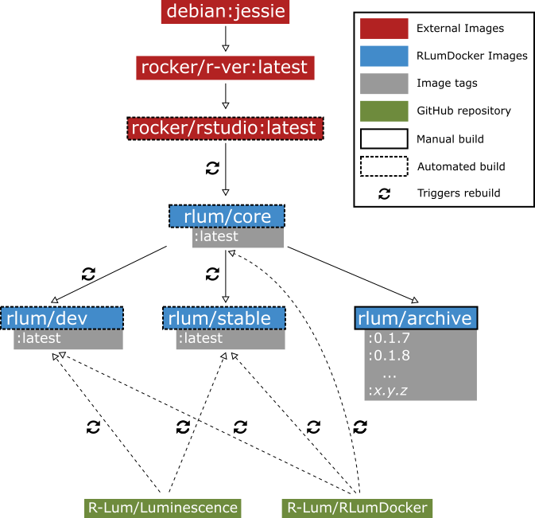

# RLumDocker
Docker images providing RStudio Server and the R package 'Luminescence'

## Docker Containers

> [R.Luminescence repositories on Docker Hub](https://hub.docker.com/u/rlum/)

> [](https://travis-ci.org/R-Lum/RLumDocker)

Image      | Subfolder | Size | Build type | Metrics | Run image
-----------|-----------|------|------------|---------| ---------
[rlum/core](https://hub.docker.com/r/rlum/core/)  | [core](https://github.com/R-Lum/RLumDocker/tree/master/core) | [](https://microbadger.com/images/rlum/core) | []() | []() |  `docker run -d -p 8787:8787 rlum/core`
[rlum/stable](https://hub.docker.com/r/rlum/stable/)| [stable](https://github.com/R-Lum/RLumDocker/tree/master/stable) | [](https://microbadger.com/images/rlum/stable) | []() | []() | `docker run -d -p 8787:8787 rlum/stable`
[rlum/dev](https://hub.docker.com/r/rlum/dev/)   | [dev](https://github.com/R-Lum/RLumDocker/tree/master/dev) | [](https://microbadger.com/images/rlum/dev) | []() | []() | `docker run -d -p 8787:8787 rlum/dev`
[rlum/archive](https://hub.docker.com/r/rlum/archive/)   | [archive](https://github.com/R-Lum/RLumDocker/tree/master/archive) | [](https://microbadger.com/images/rlum/archive) | []() | []() | `docker run -d -p 8787:8787 rlum/archive:<version>`
[rlum/drac](https://hub.docker.com/r/rlum/drac/)   | [drac](https://github.com/R-Lum/RLumDocker/tree/master/drac) | [](https://microbadger.com/images/rlum/drac) | []() | []() | `docker run -d -p 80:80 rlum/drac:<version>`

## Image content

The base image `rlum/core` builds on top of `rocker/rstudio:latest` ([see the 'rocker'-project by D. Eddelbuettel and C. Boettiger](https://github.com/rocker-org/rocker)) with additional installs of:
* *JAGS*
* rgl
* devtools
* ggplot2
* tidyverse
* rmarkdown

`rlum/stable` contains the following packages currently available on CRAN:
* Luminescence
* RLumModel
* RLumShiny

`rlum/dev` installs the latest development versions of these packages via `devtools::install_github()` from the following repositories:
* R-Lum/Luminescence@dev_x.x.x
* R-Lum/RLumModel@dev_x.x
* tzerk/RLumShiny@master

`rlum/archive` provides static Docker images for each release version of the R package 'Luminescence'. See the table below for all available images.

## Dose Rate and Age Calculator (DRAC) images

This repository also includes Dockerfiles to create docker images running an [Apache server with PHP 7.0](https://hub.docker.com/_/php/) that hosts [DRAC](https://github.com/DRAC-calculator/DRAC-calculator). Pre-made images are available [here](https://hub.docker.com/r/rlum/drac/) and can be run using `docker run -d -p 80:80 rlum/drac:<version>` (replace `<version>` with any of the tags listed [here](https://hub.docker.com/r/rlum/drac/tags/)). Once the container has been started open your browser and open [http://localhost/](http://localhost).

## Quick usage guide

**Install docker**

Please follow one of the following guides depending on your OS:

* [Windows](https://docs.docker.com/docker-for-windows/)
* [Mac](https://docs.docker.com/docker-for-mac/)
* [Linux](https://docs.docker.com/engine/installation/linux/)


**Run container**

First, make sure that Docker has been successfully installed and that the Docker service is running. In your preferred command-line interface (bash, CMD, powershell, ...) type in:

```
docker run -d -p 8787:8787 rlum/stable:latest
```

This command will automatically download (only once) and run the docker image that includes RStudio with the R packages 'Luminescence', 'RLumModel' and 'RLumShiny' pre-installed. The `-d` (or `--detach`) flag tells Docker to run the container in the background. With `-p 8787:8787` we further specify the port on which RStudio Server listens to. The service should start immediately. The RStudio interface is then available on `http://localhost:8787`. `rlum/stable:latest` refers to the username (`rlum`), repository (`stable`) and image tag (`latest`). If you want to use an older version of 'Luminescence' located in the `archive` repository use e.g. `rlum/archive:0.4.4`.

**Stop container**

Copy and run the following line in the shell (this does **not** work in windows CMD!):

```
docker stop $(docker ps -a -q)
```

## Dependency graph



## Archived version

### Version 0.1.x

Version  | Size  | Pull image | Run image
:--------|:------|:-----------|----------
[](https://microbadger.com/images/rlum/archive:0.1.7) | [](https://microbadger.com/images/rlum/archive:0.1.7) | `docker pull rlum/archive:0.1.7` | `docker run -d -p 8787:8787 rlum/archive:0.1.7`
[](https://microbadger.com/images/rlum/archive:0.1.8) | [](https://microbadger.com/images/rlum/archive:0.1.8) | `docker pull rlum/archive:0.1.8` | `docker run -d -p 8787:8787 rlum/archive:0.1.8`

### Version 0.2.x

Version  | Size  | Pull image | Run image
:--------|:------|:-----------|----------
[](https://microbadger.com/images/rlum/archive:0.2.0) | [](https://microbadger.com/images/rlum/archive:0.2.0) | `docker pull rlum/archive:0.2.0` | `docker run -d -p 8787:8787 rlum/archive:0.2.0`
[](https://microbadger.com/images/rlum/archive:0.2.1) | [](https://microbadger.com/images/rlum/archive:0.2.1) | `docker pull rlum/archive:0.2.1` | `docker run -d -p 8787:8787 rlum/archive:0.2.1`
[](https://microbadger.com/images/rlum/archive:0.2.2) | [](https://microbadger.com/images/rlum/archive:0.2.2) | `docker pull rlum/archive:0.2.2` | `docker run -d -p 8787:8787 rlum/archive:0.2.2`
[](https://microbadger.com/images/rlum/archive:0.2.3) | [](https://microbadger.com/images/rlum/archive:0.2.3) | `docker pull rlum/archive:0.2.3` | `docker run -d -p 8787:8787 rlum/archive:0.2.3`
[](https://microbadger.com/images/rlum/archive:0.2.4) | [](https://microbadger.com/images/rlum/archive:0.2.4) | `docker pull rlum/archive:0.2.4` | `docker run -d -p 8787:8787 rlum/archive:0.2.4`

### Version 0.3.x

Version  | Size  | Pull image | Run image
:--------|:------|:-----------|----------
[](https://microbadger.com/images/rlum/archive:0.3.0) | [](https://microbadger.com/images/rlum/archive:0.3.0) | `docker pull rlum/archive:0.3.0` | `docker run -d -p 8787:8787 rlum/archive:0.3.0`
[](https://microbadger.com/images/rlum/archive:0.3.1) | [](https://microbadger.com/images/rlum/archive:0.3.1) | `docker pull rlum/archive:0.3.1` | `docker run -d -p 8787:8787 rlum/archive:0.3.1`
[](https://microbadger.com/images/rlum/archive:0.3.2) | [](https://microbadger.com/images/rlum/archive:0.3.2) | `docker pull rlum/archive:0.3.2` | `docker run -d -p 8787:8787 rlum/archive:0.3.2`
[](https://microbadger.com/images/rlum/archive:0.3.3) | [](https://microbadger.com/images/rlum/archive:0.3.3) | `docker pull rlum/archive:0.3.3` | `docker run -d -p 8787:8787 rlum/archive:0.3.3`
[](https://microbadger.com/images/rlum/archive:0.3.4) | [](https://microbadger.com/images/rlum/archive:0.3.4) | `docker pull rlum/archive:0.3.4` | `docker run -d -p 8787:8787 rlum/archive:0.3.4`

### Version 0.4.x

Version  | Size  | Pull image | Run image
:--------|:------|:-----------|----------
[](https://microbadger.com/images/rlum/archive:0.4.0) | [](https://microbadger.com/images/rlum/archive:0.4.0) | `docker pull rlum/archive:0.4.0` | `docker run -d -p 8787:8787 rlum/archive:0.4.0`
[](https://microbadger.com/images/rlum/archive:0.4.1) | [](https://microbadger.com/images/rlum/archive:0.4.1) | `docker pull rlum/archive:0.4.1` | `docker run -d -p 8787:8787 rlum/archive:0.4.1`
[](https://microbadger.com/images/rlum/archive:0.4.2) | [](https://microbadger.com/images/rlum/archive:0.4.2) | `docker pull rlum/archive:0.4.2` | `docker run -d -p 8787:8787 rlum/archive:0.4.2`
[](https://microbadger.com/images/rlum/archive:0.4.3) | [](https://microbadger.com/images/rlum/archive:0.4.3) | `docker pull rlum/archive:0.4.3` | `docker run -d -p 8787:8787 rlum/archive:0.4.3`
[](https://microbadger.com/images/rlum/archive:0.4.4) | [](https://microbadger.com/images/rlum/archive:0.4.4) | `docker pull rlum/archive:0.4.4` | `docker run -d -p 8787:8787 rlum/archive:0.4.4`
[](https://microbadger.com/images/rlum/archive:0.4.5) | [](https://microbadger.com/images/rlum/archive:0.4.5) | `docker pull rlum/archive:0.4.5` | `docker run -d -p 8787:8787 rlum/archive:0.4.5`
[](https://microbadger.com/images/rlum/archive:0.4.6) | [](https://microbadger.com/images/rlum/archive:0.4.6) | `docker pull rlum/archive:0.4.6` | `docker run -d -p 8787:8787 rlum/archive:0.4.6`

### Version 0.5.x

Version  | Size  | Pull image | Run image
:--------|:------|:-----------|----------
[](https://microbadger.com/images/rlum/archive:0.5.0) | [](https://microbadger.com/images/rlum/archive:0.5.0) | `docker pull rlum/archive:0.5.0` | `docker run -d -p 8787:8787 rlum/archive:0.5.0`
[](https://microbadger.com/images/rlum/archive:0.5.1) | [](https://microbadger.com/images/rlum/archive:0.5.1) | `docker pull rlum/archive:0.5.1` | `docker run -d -p 8787:8787 rlum/archive:0.5.1`

### Version 0.6.x

Version  | Size  | Pull image | Run image
:--------|:------|:-----------|----------
[](https://microbadger.com/images/rlum/archive:0.6.0) | [](https://microbadger.com/images/rlum/archive:0.6.0) | `docker pull rlum/archive:0.6.0` | `docker run -d -p 8787:8787 rlum/archive:0.6.0`
[](https://microbadger.com/images/rlum/archive:0.6.1) | [](https://microbadger.com/images/rlum/archive:0.6.1) | `docker pull rlum/archive:0.6.1` | `docker run -d -p 8787:8787 rlum/archive:0.6.1`
[](https://microbadger.com/images/rlum/archive:0.6.2) | [](https://microbadger.com/images/rlum/archive:0.6.2) | `docker pull rlum/archive:0.6.2` | `docker run -d -p 8787:8787 rlum/archive:0.6.2`
[](https://microbadger.com/images/rlum/archive:0.6.4) | [](https://microbadger.com/images/rlum/archive:0.6.4) | `docker pull rlum/archive:0.6.4` | `docker run -d -p 8787:8787 rlum/archive:0.6.4`

### Version 0.7.x

Version  | Size  | Pull image | Run image
:--------|:------|:-----------|----------
[](https://microbadger.com/images/rlum/archive:0.7.0) | [](https://microbadger.com/images/rlum/archive:0.7.0) | `docker pull rlum/archive:0.7.0` | `docker run -d -p 8787:8787 rlum/archive:0.7.0`
[](https://microbadger.com/images/rlum/archive:0.7.3) | [](https://microbadger.com/images/rlum/archive:0.7.3) | `docker pull rlum/archive:0.7.3` | `docker run -d -p 8787:8787 rlum/archive:0.7.3`
[](https://microbadger.com/images/rlum/archive:0.7.4) | [](https://microbadger.com/images/rlum/archive:0.7.4) | `docker pull rlum/archive:0.7.4` | `docker run -d -p 8787:8787 rlum/archive:0.7.4`
